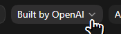
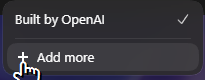
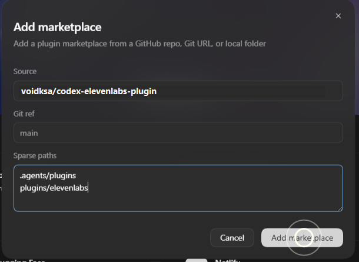
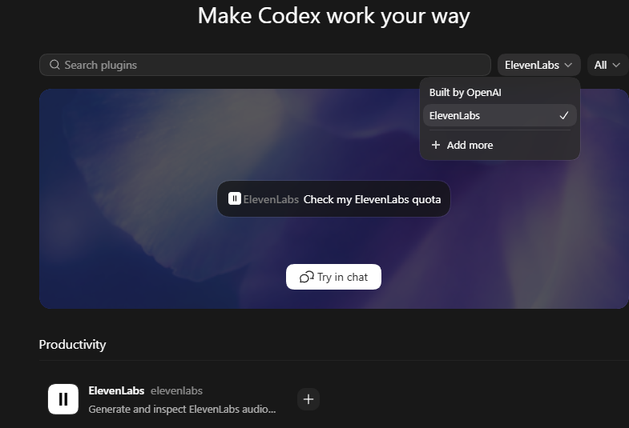
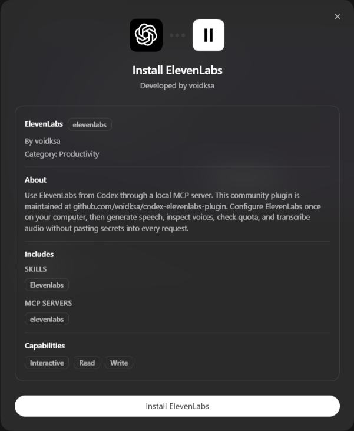

<h1>ElevenLabs for Codex</h1>

Use ElevenLabs in Codex without pasting your API key into every chat. Generate speech, pick voices, use v3-style delivery presets, clean audio, create sound effects, compose music, dub media, and transcribe files.

 

<h2>Add to Codex</h2>

Open <strong>Plugins</strong>, choose <strong>Add more</strong>, then add this marketplace.

 

<h3>Source</h3>

<pre><code>voidksa/codex-elevenlabs-plugin</code></pre>

<h3>Git ref</h3>

<pre><code>main</code></pre>

<h3>Sparse paths</h3>

<pre><code>.agents/plugins
plugins/elevenlabs</code></pre>

Click <strong>Add marketplace</strong>. After it is added, select <strong>ElevenLabs</strong> from the marketplace menu.

Open the ElevenLabs card, then click <strong>Install ElevenLabs</strong>.

Restart Codex if ElevenLabs does not appear right away.

If Codex shows <strong>Failed to add marketplace</strong>, check the Source field first. Use <code>voidksa/codex-elevenlabs-plugin</code>, not the browser URL.

 

<h2>Connect ElevenLabs</h2>

Each person uses their own ElevenLabs API key. The key is stored locally on their computer and is not committed to this repository.

From the plugin folder:

<pre><code>cd plugins\elevenlabs
powershell -ExecutionPolicy Bypass -File .\scripts\set-api-key.ps1</code></pre>

On Windows, the key is saved outside the repo at:

<pre><code>%APPDATA%\Codex\elevenlabs\api-key.dpapi</code></pre>

 

<h2>Security</h2>

This repo does not include any API keys. Do not commit <code>.env</code>, generated audio, <code>node_modules</code>, or DPAPI key files.

 

<h2>Trademark</h2>

ElevenLabs and the ElevenLabs logo are trademarks of ElevenLabs. This community plugin is not an official ElevenLabs product.

